# Clicker Game

## UX

### Project Goal

The purpose of the 'Clicker Game' is to be a single page website hosting a simple game. The game is 'endless' but you lose when the timer runs out, with the timer resetting everytime the user 'clicks' on the a target. When a game over scene happenes, a message will appear announcing it and provides the user with their score. The user earns score by clicking on the target. It needs to have a large amount of interactivity.

#### Bare minimum

The features that are needed for a minimum viable product.

* The game needs to load

* The instructions need to load

* The game needs to work as intended without any major bugs

* The game needs to give and track score

* The game needs to reset the score after a game over

* The timer needs to work and end the game when it runs out

* The game needs to present final score at the game over

#### Additional features

Features that can be added if time is available

* Timer can be fancy graphics

* The target will move after every click

* A sound effect (possibly an api) will play on every target click

* Possible upgrades, spending score to earn more score

### User goals

#### First time users

* To be able to quickly understand how to play the game

* To be able to start playing the game with no confusion/hassle

* For the game to run smoothly

#### Returning user

* To be able to quickly get into a game

* For the score to be obvious and easy to read to compare attempts

### Wireframes

#### Phone Wireframe:

#### Tablet Wireframe:

#### Computer Wireframe:

### Design choices

#### Colours

Components with a bold and bright yellow colour are items I wish the user focuses on. As such, it's a bright and contrasting colour compared to the rest of the page, with the yellow meant to invoke feelings of excitment or joy. Text on yellow backgrounds will remain black to keep readability. The mute blue and grey backgrounds for the game/text area is to prevent eye strain and as to not distract the user while they're clicking on the target. Text will remain black for now, with possible tweaking required if the contrast is not strong enough, likely to the background shade of grey.

The scoreboard will remain plain white. This is due to two reasons: I want the user to focus on it, but not over use yellow. From planning wireframe, the current design is already approaching the limit on how much yellow can be used before it no-longer grabs the user's attention and instead becomes obnoxious. As such, I have chosen for it to be a colourless white to help break up the page while still being eye grabbing.

The timer bar is a mixture of green and red. This is due to the simple colour theory of green being good and red being bad and the emotions they produce. As the timer goes down, the red grows alongside the emotions it envokes. With every click, the timer is reset and green fills the bar, once again bringing its positive emotions. This is to subtly reward/hint the player on want they're meant to do even if they have not read the instructions.

The div that covers the screen on document load is there to explain how to play, as such it uses to bright yellow colours (the title and start button) to create excitement, with the dull colours around them to only strengthen their effects.

The game over message being red follows the previous parapgraph's logic of symbolising a negative thing, in this case losing the game. However, it is promptly followed by the score being a bright yellow to bring back some joy and excitement.

Social media icons are yellow to create an arua of positivity, as we want users to click on them. The play again button is yellow to create excitement and persuade the user to try again and see if they can beat their prevous score.

#### Layout

The page's layout is blocked out into large chunks with the game area being the largest. This is because it is the main focus of the page. Then the page is broken down further into three medium sized sections, consisting of: Title/h1, score and timer, and upgrades. This is because I want them to still recieve attention from the user but secondarily to the main content/game. The large blocky elements with little/no small elements (if you exclude the target) ensures the page is quick and easy to read, which is important when the game has a timer.

Lastily, the welcome/instructions and the game over divs. The instructions section will cover the screen upon the page loading, only disapearing once the user selects the 'play' button. The game over screen is similar in that it covers the screen and the button at the bottom resets the game. This is because they both server the same purpose: stopping the user from interacting with the game until either they have read how to play or preventing the user from playing the game once finished. Both of them are very simple in design as to get their points across as quickly as possible.

## Features

### Existing features

#### Instructions

* The instructions need to load

#### Headers

Main h1 header:

* Bold, clear, and easy to read

* Uses h1 element, giving it an extra boost in search results

* Very short and not flashy, won't drag the user's attention away from game

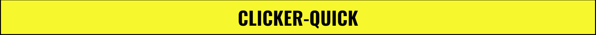

Instructions h2 header:

* Bold, clear, and easy to read

* Shares colours and styling with h1 header to create a common theme

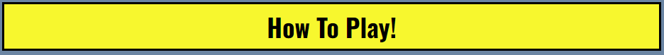

Game over h2:

* Bold, clear, and easy to read

* Large amount of read is very catching and creates a negative colour message

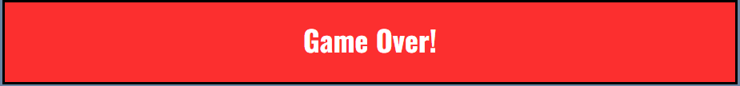

#### Score

* The game needs to give and track score

#### Timer

* The timer needs to work and end the game when it runs out

* Timer can be fancy graphics

#### Game area

* The game needs to load

* The game needs to work as intended without any major bugs

* The target will move after every click

#### Upgrades

* Possible upgrades, spending score to earn more score

#### Footer

#### Game over

* The game needs to reset the score after a game over

* The game needs to present final score at the game over

### Features to be added

* A sound effect (possibly an api) will play on every target click

* Change both h2 headers of how to play and game over to be the same size

* Logo, favicon

## Technology Used

### Languages

Html5

CSS3

JavaScript

### Frameworks, libraries, and programs used

* [Balsamiq](https://balsamiq.cloud)

Used in the planning and making of the website's wireframe.

* [jQuery](https://jquery.com/)

For the interactive elements covering the entire website.

* [Git](https://git-scm.com/)

Used for version control by utilising the Gitpod terminal to commit to Git and Push to GitHub.

* [Github](https://github.com/)

Used to store the project's code.

## Testing

### BBD vs TDD

#### Differences between BDD and TDD

The main difference between BDD (Behaviour Driven Development) and TDD (Test Driven Development) is that BDD is about tests being done manually while TDD is about test being checked automatically by the computer. TDD is written before the software and improved to meet updated goals, the cycle repeating over and over until the product is finished and passes all tests. BDD is tested as the code is written against the user stories, with the user manually checking changes on different media and screensizes until completion. BDD tests can cause the program to end up feeling more intuative and requires no software, leading it to be simpliar for a developer. Meanwhile, TDD can test extreme conditions and more conditons at a very fast rate, causing the program to end up being more stable.

#### Why I chose BDD testing

I chose the BDD testing method for the following reasons:

* Time

Due to the limited timeframe inwhich I had to make the project, TTD style development would take too long and would likely cause me to miss my dealine. As such, to ensure project completion, I opted against TDD testing.

* Intuitiveness

The website/game requires constant user interaction in a short amount of time, as such, I made the user the largest focus in this project. BDD natuarally leads to greater user intuitiveness, leading it to be the better option compared to TDD.

### Validators

### Bug Fixing

#### The issue: Target movement

In my original thinking, I believed I could move the image randomly by changing css code for the image with the left and top positioning using jquery and .random(). However, this led to me encountering the bug of the game target not only leaving the game area, but also sometimes exceeding the width/height of the website.

Current code:
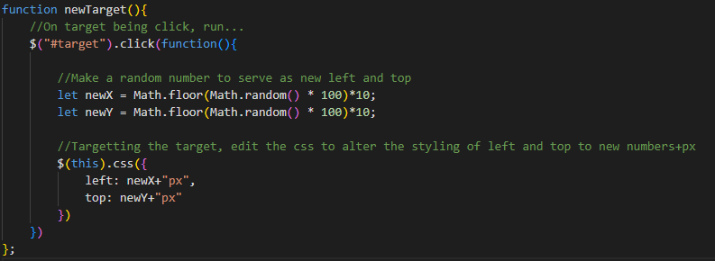

Target in game area:

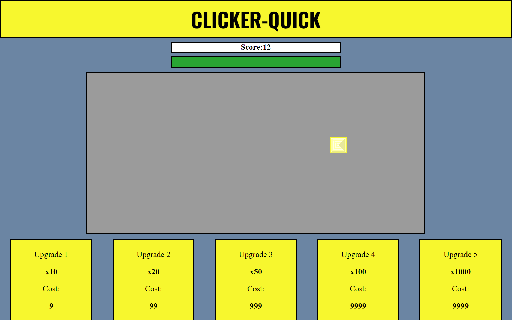

Target leaving the game area:

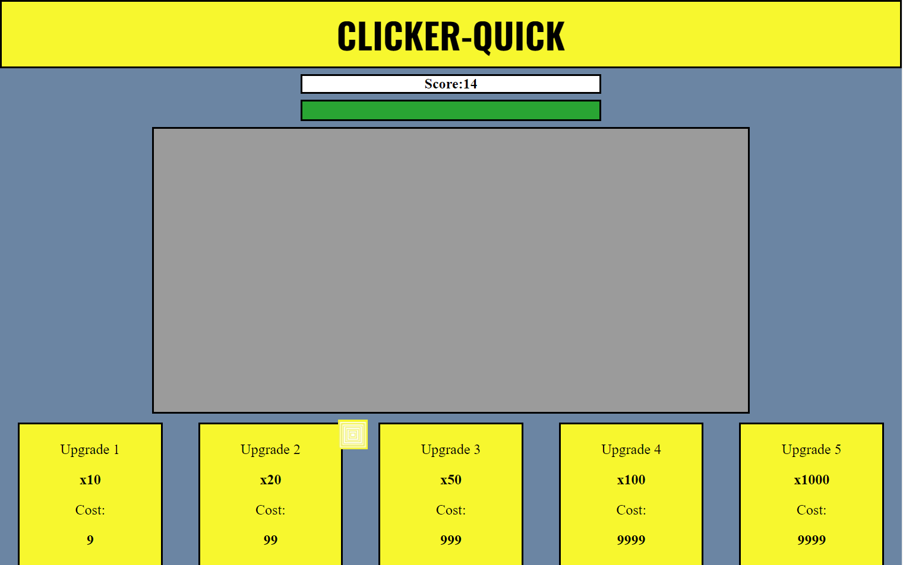

Target leaving game area and stretching the page:

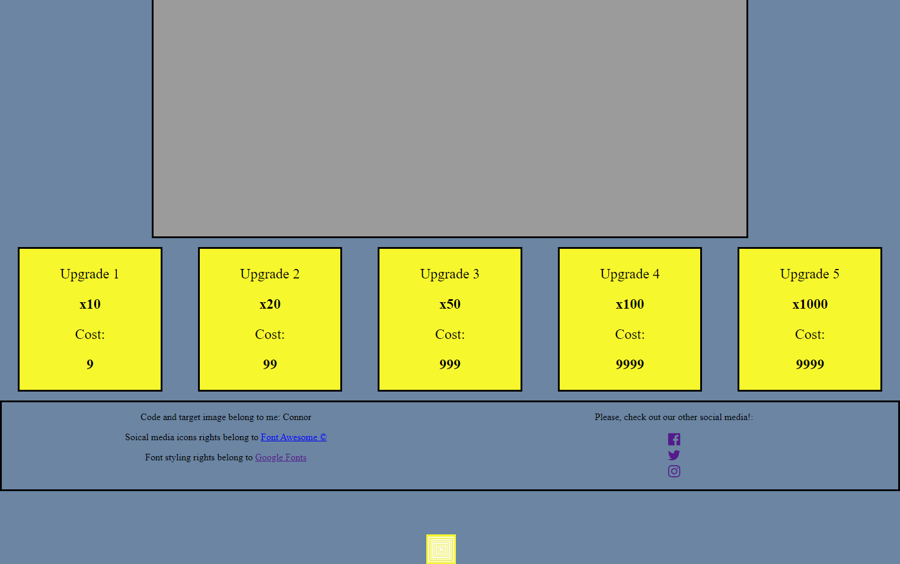

#### The solution: width/height targetting

I believe I can solve this issue by targetting the width and height of the game area using .width() and .height() then making sure the target's new postion does not exceed those numbers. 

First step would be to save the game area's values of width() and height() to a couple of variables.

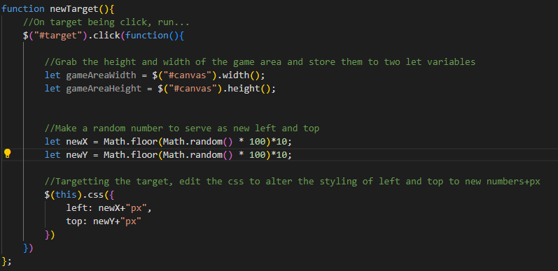

Then, seeing as .random() create a random number between 0 and 1, if I times it by the value I just created, then it should create a number that fits inside the game area's area even at the highest roll.

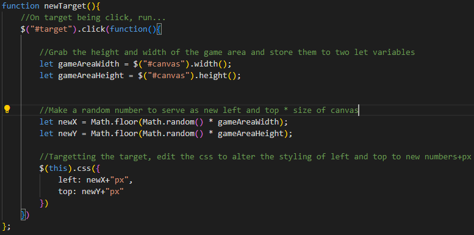

This worked incredibly well, with the target staying within the game area. Except it occasional would slightly leave the game area by the size of itself. What was clearly happening was a high roll number by the .random() (either in width or height) caused the target to be placed at the very edge of the canvas, with the 50px large image cuasing it to overflow and leave the game area.

Target staying in game area (pc)

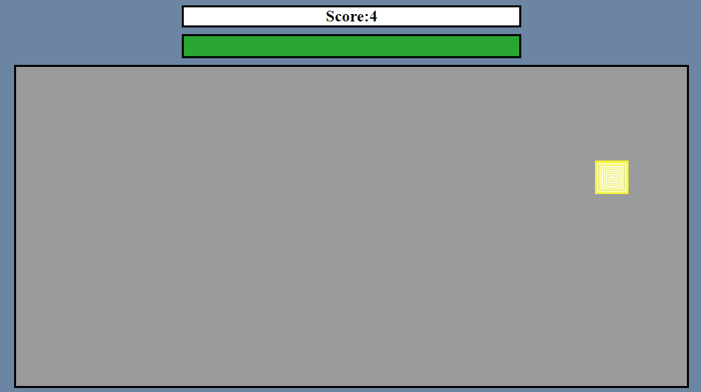

Target staying in area (mobile)

Target just barely leaving leaving the game area

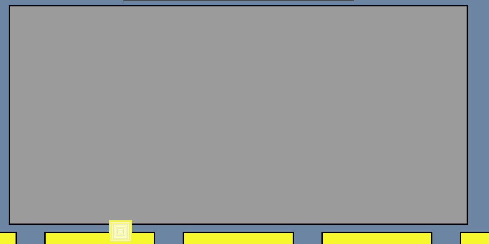

The simpliest method I decided to deal with this would be to minus 50px (size of the target image in px)

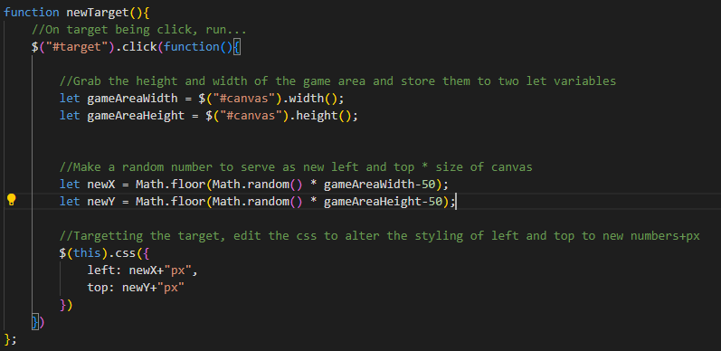

However this lead to the inverse happening, where a low roll by the random function would also cause the target to leave

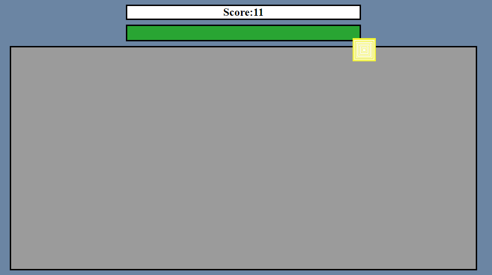

This caused me to remove the +/-50 from the newX/newY variables entirely, and instead move it to the variables gameAreaWidth and gameAreaHeight. I believed that this would solve the problem by reducing the max height and width that would multiply the random later.

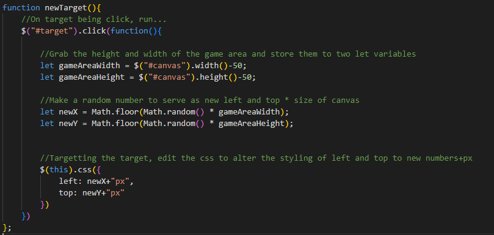

This has worked in fixing the overlap bug.

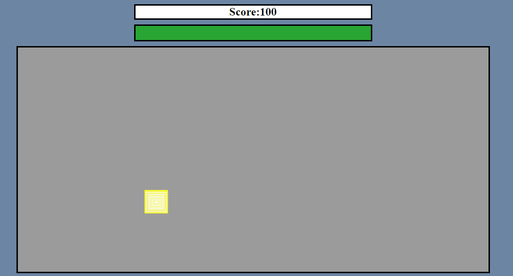

## Deployment

### User goals

### GitHub

## Credits

### Code

*[W3Schools](https://www.w3schools.com/)

Used to learn about [animate method](https://www.w3schools.com/jquery/eff_animate.asp) for the timer div in jquery.

Used to learn about [user select](https://www.w3schools.com/howto/howto_css_disable_text_selection.asp) to disable selection for the upgrade cards.

### Media/Content

 * [Balsamiq](https://balsamiq.cloud)

Used in the planning and making of the website's wireframe.

* [Font Awesome](https://fontawesome.com/v4/icons/)

Used in the logos of the social media links.

* [Google Fonts](https://fonts.google.com/)

Used in title elements using thw Oswald family of fonts.

### Thanks