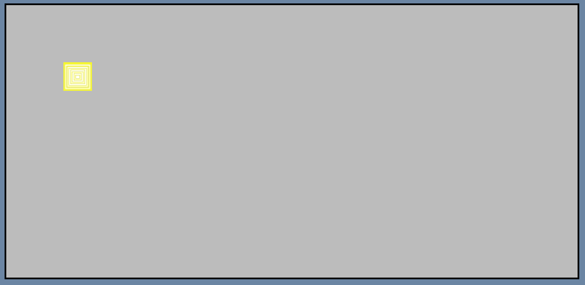

# Clicker Game

## UX

### Project Goal

The purpose of the 'Clicker Game' is to be a single-page website hosting a simple game. The game is 'endless' but you lose when the timer runs out, with the timer resetting every time the user 'clicks' on the target. When a game-over scene happens, a message will appear announcing it and provide the user with their score. The user earns score by clicking on the target. It needs to have a large amount of interactivity.

#### Bare minimum

The features that are needed for a minimum viable product.

* The game needs to load

* The instructions need to load

* The game needs to work as intended without any major bugs

* The game needs to give and track score

* The game needs to reset the score after a game over

* The timer needs to work and end the game when it runs out

* The game needs to present the final score at the game over

#### Additional features

Features that can be added if time is available

* The timer can be fancy graphics

* The target will move after every click

* A sound effect (possibly an API) will play on every target click

* Possible upgrades, spending score to earn more score

### User goals

#### First-time users

* To be able to quickly understand how to play the game

* To be able to start playing the game with no confusion/hassle

* For the game to run smoothly

#### Returning user

* To be able to quickly get into a game

* For the score to be obvious and easy to read to compare attempts

### Wireframes

#### Phone Wireframe:

#### Tablet Wireframe:

#### Computer Wireframe:

### Design choices

#### Colours

Components with a bold and bright yellow colour are items I wish the user focuses on. As such, it's a bright and contrasting colour compared to the rest of the page, with the yellow meant to invoke feelings of excitement or joy. Text on yellow backgrounds will remain black to keep readability. The mute blue and grey backgrounds for the game/text area are to prevent eye strain and to not distract the user while they're clicking on the target. Text will remain black for now, with possible tweaking required if the contrast is not strong enough, likely to the background shade of grey.

The scoreboard will remain plain white. This is due to two reasons: I want the user to focus on it, but not overuse yellow. From the planning wireframe, the current design is already approaching the limit on how much yellow can be used before it no longer grabs the user's attention and instead becomes obnoxious. As such, I have chosen for it to be a colourless white to help break up the page while still being eye-grabbing.

The timer bar is a mixture of green and red. This is due to the simple colour theory of green being good and red being bad and the emotions they produce. As the timer goes down, the red grows alongside the emotions it evokes. With every click, the timer is reset and green fills the bar, once again bringing its positive emotions. This is to subtly reward/hint the player on what they're meant to do even if they have not read the instructions.

The div that covers the screen on document load is there to explain how to play, as such it uses to bright yellow colours (the title and start button) to create excitement, with the dull colours around them to only strengthen their effects.

The game-over message being red follows the previous paragraph's logic of symbolising a negative thing, in this case losing the game. However, it is promptly followed by the score being a bright yellow to bring back some joy and excitement.

Social media icons are yellow to create an aura of positivity, as we want users to click on them. The play again button is yellow to create excitement and persuade the user to try again and see if they can beat their previous score.

#### Layout

The page's layout is blocked out into large chunks with the game area being the largest. This is because it is the main focus of the page. Then the page is broken down further into three medium-sized sections, consisting of title/h1, score and timer, and upgrades. This is because I want them to still receive attention from the user but secondarily to the main content/game. The large blocky elements with little/no small elements (if you exclude the target) ensure the page is quick and easy to read, which is important when the game has a timer.

Lastly, the welcome/instructions and the game over divs. The instructions section will cover the screen upon the page loading, only disappearing once the user selects the 'play' button. The game over screen is similar in that it covers the screen and the button at the bottom resets the game. This is because they both serve the same purpose: stopping the user from interacting with the game until either they have read how to play or preventing the user from playing the game once finished. Both of them are very simple in design to get their points across as quickly as possible.

## Features

### Existing features

#### Instructions

* The instructions load on the document load

* Hovering on the 'start game' button changes its border colour, responding to user interactivity

* Scrollable when its length exceeds document height

#### Headers

Main h1 header:

* Bold, clear, and easy to read

* Uses h1 element, giving it an extra boost in search results

* Very short and not flashy, won't drag the user's attention away from game

Instructions h2 header:

* Bold, clear, and easy to read

* Shares colours and styling with h1 header to create a common theme

Game over h2:

* Bold, clear, and easy to read

* Large amount of read is very eye-catching and creates a negative colour message

#### Score

* A block of solid white makes it extra bold, with black text making it easy to read

* The game tracks the score as it increases and decreases, changing to the user's input

#### Timer

* The timer works in counting down and restarting, reacting to user interaction

* The timer has fancy, animated graphics that stands out from the rest of the website

* The timer is bold and easy to read

#### Game area

* The game loads and moves on the target being clicked, reacting to the user's interaction

* The target does not leave the game area

* Dull background prevents eyestrain

* Bright target makes it easy to read and spot, important for the game

#### Upgrades

* Border changes colour when hovered over, reacting to user interaction

* Changes score multiplier on an upgrade being purchased, reacting to user interaction

* Changes background to red if the user doesn't have enough score to purchase an upgrade, reacting to user interaction

#### Footer

* Contains copyrights

* Contains social media backup links

* Simple and not very eye-catching to prevent dragging attention away from the game

 

#### Game over

* On a new game, the score and score multiplier are reset back to zero

* The game presents the final score at the game over

* Links to social media

* Stops target from being clicked while up

* Restart button changes border colour when hovered over, responding to user interactivity

#### 404 page

* Clear and easy to read

* Working link back to game/index.html

* Minimal design and content to not add unneeded loading time

### Features to be added

* A sound effect (possibly an API) will play on every target click

* Change both h2 headers of how to play and game over to be the same size

* Add a logo/favicon

### Feature choice: instructions and game-over

A conscious decision I made when making my website was to have the content of the instructions and game-over be held within the JS file instead of the HTML file. I recognise that I could have put the content into the HTML file and target the CSS attribute visibility in JS to make it visible or not, leading to cleaner HTML and JS files. However, I decided to put the content in the JS file due to the desire to use as much JS as possible.

## Technology Used

### Languages

Html5

CSS3

JavaScript

Jquery

### Frameworks, libraries, and programs used

* [Balsamiq](https://balsamiq.cloud)

Used in the planning and making of the website's wireframe.

* [jQuery](https://jquery.com/)

For the interactive elements covering the entire website.

* [Git](https://git-scm.com/)

Used for version control by utilising the Gitpod terminal to commit to Git and Push to GitHub.

* [Github](https://github.com/)

Used to store the project's code.

## Testing

### BBD vs TDD

#### Differences between BDD and TDD

The main difference between BDD (Behaviour Driven Development) and TDD (Test Driven Development) is that BDD is about tests being done manually while TDD is about tests being checked automatically by the computer. TDD is written before the software and improved to meet updated goals, the cycle repeating over and over until the product is finished and passes all tests. BDD is tested as the code is written against the user stories, with the user manually checking changes on different media and screen sizes until completion. BDD tests can cause the program to end up feeling more intuitive and require no software, leading it to be simpler for a developer. Meanwhile, TDD can test extreme conditions and more conditions at a very fast rate, causing the program to end up being more stable.

#### Why I chose BDD testing

I chose the BDD testing method for the following reasons:

* Time

Due to the limited timeframe in which I had to make the project, TTD-style development would take too long and would likely cause me to miss my deadline. As such, to ensure project completion, I opted against TDD testing.

* Intuitiveness

The website/game requires constant user interaction in a short amount of time, as such, I made the user the largest focus in this project. BDD naturally leads to greater user intuitiveness, leading it to be the better option compared to TDD.

#### BDD example with clicker quick

When I, a user, enter the webpage, I want to be:

* Greeted with the instructions
* For the instructions to be clear and readable on any device
* I want to be able to start the game by pressing the 'start game' button

### Testing user goals using BDD

Using the user goals stated at the start of the README, I can use BDD testing to check if I have achieved the goals:

#### First-time users

* To be able to quickly understand how to play the game

- Upon entering the website I am introduced to the instructions

- The instructions are easy to read and understand on any device

* To be able to start playing the game with no confusion/hassle

- Instructions are clear to understand

- Little clatter and clear, bold lines/colours prevents the game from becoming muddled

* For the game to run smoothly

- There is no noticeable lag, delay, or other disturbing occurrences while playing

#### Returning user

* To be able to quickly get into a game

- Page is very quick to load

- One click is all that is needed to start playing

- On game over, one click is all that is needed to try again

* For the score to be obvious and easy to read to compare attempts

- Bold colour choice and clear separation from other elements makes the score easy to read

### Bug Fixing

#### The issue: Target movement

In my original thinking, I believed I could move the image randomly by changing the CSS code for the image with the left and top positioning using jQuery and .random(). However, this led to me encountering the bug of the game target not only leaving the game area but also sometimes exceeding the width/height of the website.

Current code:

Target in-game area:

Target leaving the game area:

Target leaving the game area and stretching the page:

#### The solution: width/height targeting

I believe I can solve this issue by targeting the width and height of the game area using .width() and .height() and then making sure the target's new position does not exceed those numbers. 

The first step would be to save the game area's values of width() and height() to a couple of variables.

Then, seeing as .random() creates a random number between 0 and 1, if I multiply it by the value I just created, then it should create a number that fits inside the game area's area even at the highest roll.

This worked incredibly well, with the target staying within the game area. Except it occasionally would slightly leave the game area by the size of itself. What was happening was a high roll number by the .random() (either in width or height) caused the target to be placed at the very edge of the canvas, with the 50px large image causing it to overflow and leave the game area.

Target staying in the game area (pc)

Target staying in the area (mobile)

Target just barely leaving the game area

The simplest method I decided to deal with this would be to minus 50px (size of the target image in px)

However, this leads to the inverse happening, where a low roll by the random function would also cause the target to leave

This caused me to remove the +/-50 from the newX/newY variables entirely, and instead move it to the variables gameAreaWidth and gameAreaHeight. I believed that this would solve the problem by reducing the max height and width which would multiply the random later.

This has worked in fixing the overlap bug.

### Validator testing

#### HTML

Using W3C validator:

[W3C report here](https://validator.w3.org/nu/?doc=https%3A%2F%2Fconnorfriday-code.github.io%2FClickerGameProjectTwo%2F)

#### CSS

Using jigsaw:

[Jigsaw report here](https://jigsaw.w3.org/css-validator/validator?uri=https%3A%2F%2Fconnorfriday-code.github.io%2FClickerGameProjectTwo%2F&profile=css3svg&usermedium=all&warning=1&vextwarning=&lang=en)

#### JS

Using JShint and console:

[Link to jshint here:](https://jshint.com/)

#### Lighthouse

[Link to lighthouse](https://pagespeed.web.dev/analysis/https-connorfriday-code-github-io-ClickerGameProjectTwo-index-html/goabrpinbb?form_factor=desktop)

## Deployment

### GitHub

Git

The site was deployed to GitHub pages through the steps as follows:

1. In the GitHub repository is the settings tab
2. On the new page there will be a menu on the left with one option being 'Pages'
3. Within this I selected the branch to be 'Main', and refreshing the page a minute later it had updated with a ribbon display to indicate success

The live link can be found here: [Live Project Link](https://connorfriday-code.github.io/ClickerGameProjectTwo/)

## Credits

### Code

* [W3Schools](https://www.w3schools.com/)

Used to learn about [animate method](https://www.w3schools.com/jquery/eff_animate.asp) for the timer div in jQuery.

Used to learn about [user select](https://www.w3schools.com/howto/howto_css_disable_text_selection.asp) to disable selection for the upgrade cards.

* [W3C](https://validator.w3.org/)

Used to find errors and help correct them in my HTML.

* [Jigsaw](https://jigsaw.w3.org/css-validator/)

Used to find errors and help correct them in my CSS.

* [jshint](https://jshint.com/)

Used to find errors and help correct them in my JS.

### Media/Content

 * [Balsamiq](https://balsamiq.cloud)

Used in the planning and making of the website's wireframe.

* [Font Awesome](https://fontawesome.com/v4/icons/)

Used in the logos of the social media links.

* [Google Fonts](https://fonts.google.com/)

Used in title elements using the Oswald family of fonts.

### Thanks/Acknowledgements

Code Institute for teaching me the knowledge of web development and providing a library of resources to return to for help